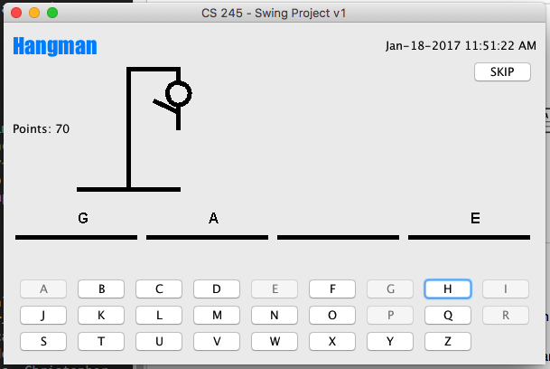
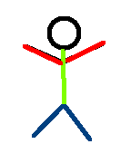

#Escuela Colombiana de Ingeniería
##Procesos de Desarrollo de Software - PDSW


Software de microcontrolador para la fabricación automática de pizza.

Entregables:

* Parte I, antes de finalizar la clase, en moodle.
* Parte II-1, impreso en la próxima clase.
* Parte II-2, antes del próximo laboratorio, vía moodle.

####Parte I. 
El siguiente, es un modelo de clases de una aplicación que se comunica con un microcontrolador encargado de la fabricación automática de pizzas. Dichas clases encapsulan la lógica para amasar, hornear y moldear pizzas de las pizzas delgadas.


El programa principal del micro-controlador utiliza la siguiente función, la cual depende de las clases antes mostradas:

```Java
public void prepararPizza(Ingredientes[] ingredientes, Tamano tam) 
throws ExcepcionParametrosInvalidos{
	AmasadorPizzaDelgada am=new AmasadorPizzaDelgada();
	HorneadorPizzaDelgada hpd=new HorneadorPizzaDelgada();
	MoldeadorPizzaDelgada mp=new MoldeadorPizzaDelgada();
	am.amasar();
	if (tam == Tamano.PEQUENA){
		mp.moldearPizzaPequena();
	}
	else if(tam==Tamano.MEDIANA){
		mp.molderarPizzaMediana();
	}
	else{
		throw new ExcepcionParametrosInvalidos (“Tamano de piza invalido:”+tam);
	}
		aplicarIngredientes(ingredientes);
		hpd.hornear();
	}
	...
```

Se quiere actualizar el software, ya que el fabricante de las máquina va a sacar al mercado unas variantes de la máquina original, y quiere simplificar el proceso de adaptación del código de los microcontroladores. Por ahora se espera sacar dos variantes:

*	Máquina para preparar pizzas de masa gruesa (masa de pan).
*	Máquina para preparar pizzas de masa integral.

Es importante tener en cuenta que para dichas variantes, aunque la secuencia de pasos del proceso principal es el mismo, los procesos de amasado, moldeado y horneado son diferentes para cada variante.

Dado que es posible que en el futuro salgan variantes adicionales de esta máquina, y que se sabe que la secuencia de pasos en general NO cambiará, se le ha pedido que el software quede escrito de manera que la lógica básica no requiera cambios, independientemente de cómo se amase, como se hornee y cómo se moldee en dichas variantes.

1.	Teniendo esto en cuenta, y considerando el patrón de fábrica abstracta, plantee el modelo de clases que permitiría desacoplar la lógica de la fabricación de pizzas, de las diferentes manera como se pueden realizar las actividades de bajo nivel relacionadas (cocción, corte, etc.).

2.	Descargue el proyecto mediante el comando git (git clone) :
```
git clone https://github.com/PDSW-2015-2/GoF-Patterns-Creational-PizzaFactory.git
```
	y ábralo en el IDE NetBeans.

3.	Revise el funcionamiento actual de la aplicación. Como este es un proyecto Maven, ejecútelo a través de la línea de comando (desde el directorio del proyecto):

```
mvn exec:java -Dexec.mainClass="edu.eci.pdsw.pizzafactory.consoleview.PreparadorPizza"
```

4.	Implemente el modelo propuesto. Para compilar después de haber hecho cambios, hágalo a través de Maven con: 

```
mvn compile
```

Nota: Si lo desea, puede revisar una [implementación de referencia del patrón Fábrica Abstracta](https://github.com/PDSW-ECI/GoF-AbstractFactory-SampleImplementation.git ), cuyo modelo corresponde al del siguiente diagrama 


####Parte II. 

Ahora, va a aplicar el patrón creacional 'fábrica abstracta' para un proceso de _refactoring_ de una implementación del popular juego 'ahorcado'. El código está basado en el proyecto creado por Omar Rodriguez, Nahid Enayatzadeh, Marc Deaso, Christopher Santos, Jazmin Guerrero, y que está disponible en https://github.com/oarodrig/SwingHangman .



La razón del _refactoring_ es un nuevo requerimiento, en el que se le ha indicado que se debe poder (1) ajustar fácilmente la identidad del juego, y (2) agregar nuevas identidades. La identidad va asociada a la región donde eventualmente sea distribuido el juego, e incluye:

* El juego de caracteres que se use en cada región.
* La representación gráfica del 'ahorcado'
* El conjunto de palabras que usará aleatoriamente el juego.

El conjunto de caracteres, la representación gráfica del ahorcado, y el conjunto de palabras usados actualmente se condierán para la región de Norte América. Se quiere, por ahora, considerar otras dos regiones:

- Latinoamérica:
	* El mismo juego de caracteres norteamericano, pero incluyendo la Ñ.
	* El personaje debe ser colorido:
	
		
	* Como conjunto de palabras, al menos cinco tomadas de [este enlace.](http://www.clarin.com/sociedad/palabras-mas-usadas-espanol-comunes-frecuentes-diccionario-real_academia_espanola_0_ByLqjSFvmg.html)

- Europa-Francia:
	* El mismo juego de caracteres norteamericano, pero incluyendo: à, è, ì, ò, ù .
	* Como hay una legislación que prohibe juegos violentos, en lugar de una horca se debe mostrar unos signos de admiración con cada fallo:
	
		
	* Como conjunto de palabras, al menos cinco tomadas de [este enlace.](http://www.lexisrex.com/Palabras-Frecuentes-Franc%C3%A9s/page=3).

### Parte II-1

Clone el proyecto de este repositorio, analice la funcionalidad de la aplicación, y haga el diseño del modelo de clases del patrón de fábrica abstracta aplicado en este contexto (no es necesario incluir las clases del juego original en el diagrama). Recuerde tener en cuenta: productos abstractos, productos concretos, fábricas abstractas, fábricas concretas. El diagrama debe mostrar métodos incluye cada clase.

### Parte II-2

Haga la implementación y rectifique que (1) se pueda cambiar la región objetivo del juego sin cambiar el código, y (2) sea factible agregar soporte a nuevas regiones.


#### Criterios de evaluación

1. Parte I.
	* Funcional. 
		1. El preparador de pizzas cambia su comportamiento al cambiar la configuración de la fábrica abstracta.

2. Parte II.

	* Diseño.

		1. En los fuentes de la vista o del control del juego no debe existir ninguna referencia a elementos que hagan referencia a una región en particular.
		
	* Funcionalidad.

		1. Sólo con cambiar la configuración de la fábrica abstracta, debe cambiar la región objetivo del juego.


